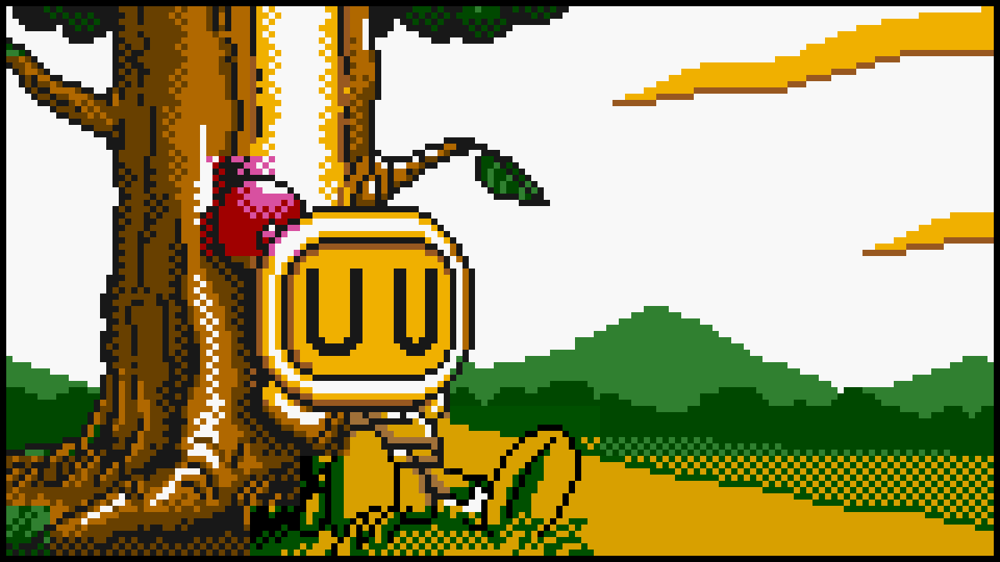

  

  <h1>Indie Studio</h1>
  
A year-end school project that is a cpp bomberman clone using raylib for graphics.

description:
a year-end school project that is a cpp bomberman clone using raylib for graphics
The binary must be moved to root after Windows compilation.

contains:
- customs maps (using .txt extension)
- saves (also in .txt)
- multiplayer (keyboard input: p1 = wasd keys; p2 = arrow keys)
- settings
- bombs

documentation:
https://en.wikipedia.org/wiki/Bomberman
https://www.raylib.com/
https://github.com/raysan5/raylib

todo:
- 3d models (not squares)
- artificial intelligence
